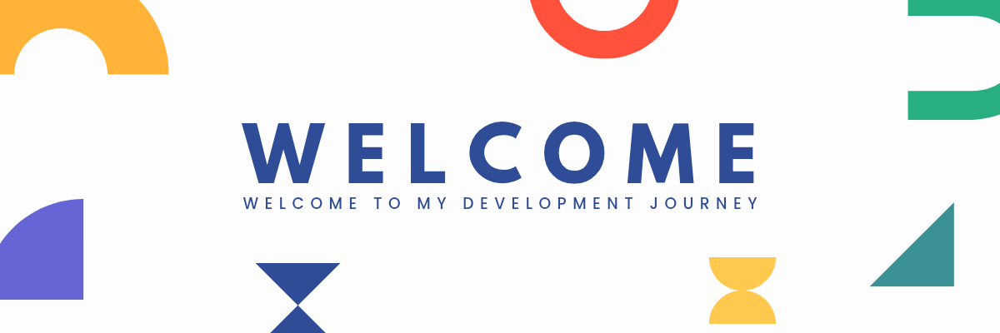

# Hi there, I'm Brian Musakwa 👋

## 🚀 About Me
- 🔭 I’m currently working on [Duck Framework](https://github.com/digreatbrian/duck-framework)
- 🌱 I’m learning **Node.js**, **Firebase**, and **React Native**
- 👨‍💻 I create **web** and **mobile apps** using **Kivy**, **Django**, and **React**
- 📫 Reach me at [digreatbrian@gmail.com](mailto:digreatbrian@gmail.com)

---

## 📈 GitHub Stats

---

## 💼 Projects & Portfolio
🌐 **[My Portfolio](https://digreatbrian.tech)**  
Explore more projects and tools on my website! For a detailed list of my projects, visit [My Projects](https://digreatbrian.tech/projects).

### Key Projects
- 🛠️ [Duck Framework](https://github.com/digreatbrian/duck-framework)  
  A Python-based webserver and framework that integrates with Django.
- 📊 [TMH Tool](http://tmh-zw.me)  
  A tool for highlighting timetable modules in Excel for better accessibility.

---

## 🛠 Skills
### Programming Languages

### Frameworks & Libraries

### Databases

---

## 💖 Support My Work
Do you enjoy my projects or find them helpful? Consider supporting me on Ko-fi! Your contributions help me dedicate more time to developing awesome tools and open-source projects.

---

## ✨ Fun Fact
🌟 **I’m always eager to learn new technologies and improve my skill set!**

---

## 💬 Connect with Me
- 
- 
- 
- 
- 
- 
- 

---

⭐️ **Check out my repositories and feel free to contribute!**
