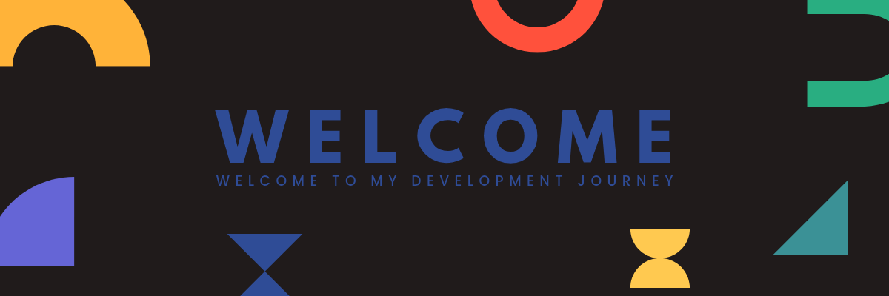
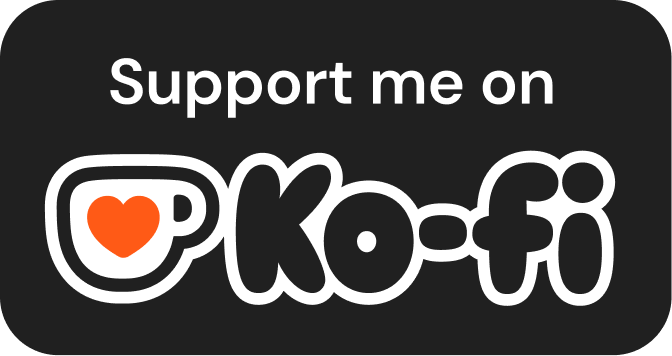

# Hi there 👋

## 🚀 About Me
- 🔭 I’m currently working on [Duck Framework](https://github.com/duckframework/duck) and I will keep working on it.
- 📫 Reach me at [digreatbrian@gmail.com](mailto:digreatbrian@gmail.com)

---

## 🛠 Skills
### Programming Languages

---

## 💖 Support My Work
Consider supporting me on Ko-fi! Thanks for your support! 

---

⭐️ **Check out any repository and feel free to contribute!**
